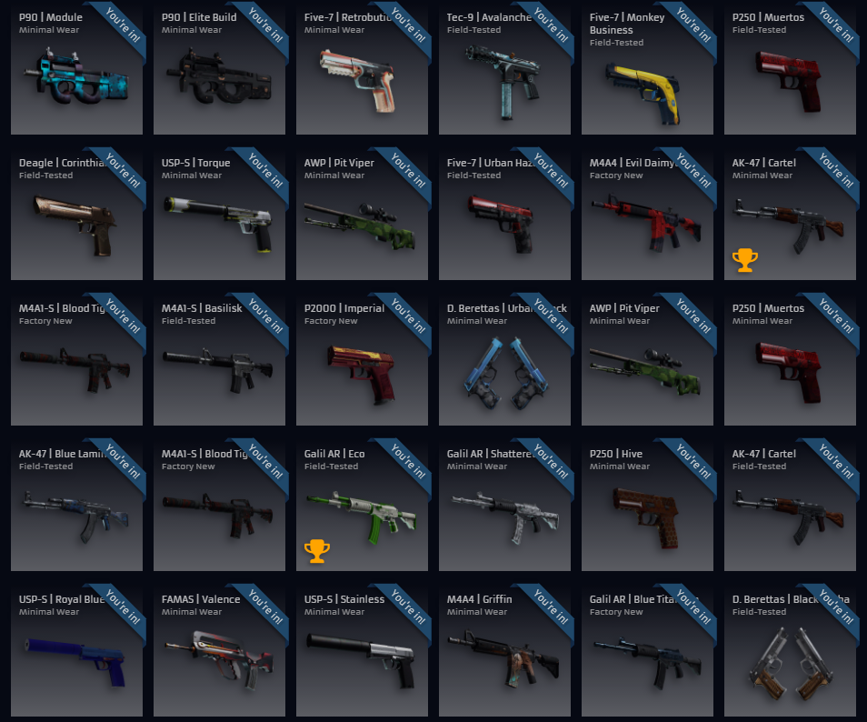

## NinjaBot - CSGORage auto join free Raffles
---



This bot use **Electron** to enter the free raffle, it create a BrowserWindow and try to enter in the free raffles every 20 minutes, it was developed to be used on a **VPS**, so there is no GUI for this application.

**NOTE:** I was unable to use this bot on my VPS because I have a problem with my VPS IP address and the CSGORage CloudFlare anti-bot scripts. My VPS IP address is banned or listed on a spam database because of the previous users. On my computer with a non-static IP address I have no problem running the bot what so ever.

It was made to be used by multiple accounts, having a database to store the user cookies.

All the communication should be over the **SocketIO** connection that the bot start everytime, this way you can create a simple HTML page and control de bot the way you like, the registratrion should be done over the socket connection as well or you can try hard code the registration data and run the bot one time.

## How to use
The first thing you should do is download all the dependencies, to do this just make sure you have **NodeJS** installed and working from the command line.

If you have NodeJS installed just type `npm install` in the console and this should download all the dependencies.

The first time you run the bot it may require CouldFlare anti-bot captcha, if that the case you have to answer the captcha since the bot cant work without it. After that the bot will store the cloudflare cookie validation to avoid any captcha in the future, but be aware that CloudFlare can and will eventually request the captcha again.

##### Configuration files
There are two configuration files that you can change, the first one is the `config.js`, on this file you can set if you are running in development mode (this will show the working window opening every check and open the developer console tools), you can set the socket port to be used, the database name, the log file name, if you want to send email's on error's and if you want to run a proxy on the application.

You can set the variable `use_proxy` to `true` and provide a proxy list on the variable `proxy_list` if you provide more than one proxy ip every check the proxy ip will be changed.

*Be aware that a lot of the time the free proxy's found on the internet have problems with CloudFlare anti-bot script, this way the functionality of this bot can be compromised*

The other configuration file that you can change is the `email.json`, you can set an **Gmail** account and password to be used to send email from the application.

##### How get the cookies
This bot will not use real Steam credentials, since it's not required on CSGORage, but it require the cookies information from CSGORage domain. 

There are a lot of ways to get the cookie information from CSGORage, the easy way is to go on Google Chrome, and open a new tab with address `chrome://settings/cookies`, search for CSGORage and copy the cookie name starting with `remember_` (copy the entire name), you have to copy the cookie value as well.

**NOTE:** If you change your Steam name the cookie will be considered invalid and you have to remove and insert the account on the database again.

##### Communication with the bot
As mentioned before this bot use SocketIO for communication, by default the socket port is `3131`, but you can change that on the configuration files.

**Events** - the bot will listen to this events, just emit and event with SocketIO, be aware that some events require a payload.
* 'global erase database' - Erase the database, removing all the stored information (users and cookies)
* 'global close' - Close the application
* 'global show database', payload - Print the database in the console, pass the **Nedb find query** as payload
* 'csgorage delete account', payload - Delete an account on database, pass the email address from the account as payload
* 'csgorage register account', payload - Register a new account, pass an user object with the
```
{
account_name: "Account name",
email: "Account email",
cookie_name: "CSGORage remember_ cookie",
cookie_value: "Cookie value"
}
```
* 'csgorage not connected', payload - **INTERN USE**: Send an email if send email is enable and close the worker window, pass the user object as payload
* 'csgorage done checking', payload - **INTERN USE**: Called once the check is done, pass the user object as payload
* 'csgorage sucess enter raffle', payload - **INTERN USE**: Called once the raffle was successful entered, pass an object with raffle name as `name` and account email as `email`.
* 'csgorage cloudflare alwaysonline', payload - **INTERN USE**: Called once CloudFlare always online is detected
* 'csgorage page error' - **INTERN USE**: Called once an errer is emited, usually when we cant get the raffle's page
* 'csgorage clear cache' - Clear the application cache
* 'csgorage cloudflare captcha' - **INTERN USE**: Called once the CloudFlare is requesting Captcha validation
* 'csgorage check raffles' - Check the raffles and try to enter any free raffle that the current account is not participating


